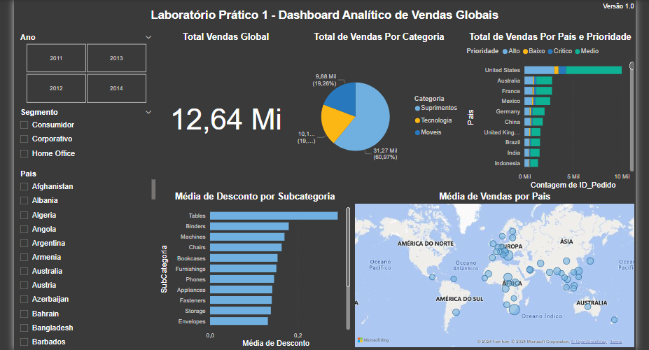

# Practical Lab 1 - Global Sales Analytical Dashboard

In Lab 1, I build the first-course Dashboard. I worked with sales data from a fictitious company that sells products worldwide.

The Dashboard should answer the questions below:
1) What is the total value sold?
2) How many sales were made per product category?
3) How many sales were made per country considering delivery priority?
4) What was the average sales discount by product subcategory?
5) Which countries had the highest average sales value? Demonstrate on a map.

The Dashboard must also allow the user to filter the data by year, segment, and country.

# Analysis

* The Supplies category provided the highest percentage of sales in all years analyzed.
* The United States has the largest number of orders, followed by France, Australia and Mexico. In all cases, medium priority sales were the most relevant.
*Tables have received the highest discount on average over the years.
* The largest financial sales volumes are concentrated in Europe, Africa and Southeast Asia.
* Although the United States has a high number of orders, the financial volume is not high, which means that many low value orders are placed in this case.
* The Home Office segment boosted the average sales in South America from 2012 onwards.
  
#
