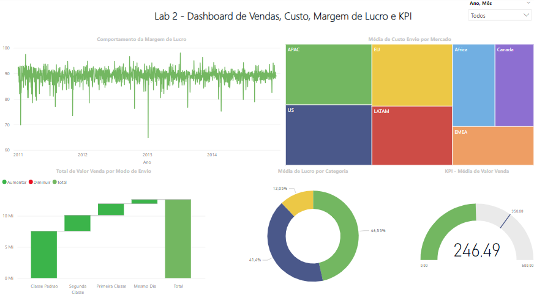

# Lab 2 - Sales, Cost, Profit Margin and KPI Dashboard

In Lab 2, I worked with Power BI's data modeling, cardinality, and data cleaning features and was also introduced to DAX.

Below are the Lab 2 business questions.

1) What was the total sales value considering each order shipping method? Use a waterfall chart.

2) Which markets had the highest average shipping cost for products sold? Use a treemap chart.

3) The company aims (goal) to maintain an average of 350 for the sales value every month. Show an indicator (KPI–Key Performance Indicator) with the average sales value. Was the company below or above the target in April/2014?

4) Profit is equivalent to sales value minus shipping cost. Which product category showed the highest average profit?

5) What was the behavior of the profit margin over time? Consider profit margin as the profit divided by the sales value.

# Analysis

* The profit margin remained at around R$90.00 throughout the period, with a significant drop in January 2013.
* The markets with the highest average shipping costs were APAC, US, EU, and LATAM.
* Standard shipping mode is the most relevant, and same-day shipping mode is of the least importance.
* The highest average profit occurs in the technology sector, followed by furniture.
* The average sales value has remained below the target throughout the period.
  
#
