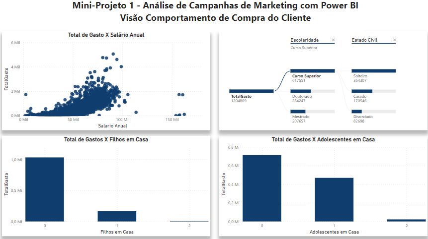

# Mini-Project 01: Marketing Campaign Analysis

This is the beginning of a sequence of 6 modules in which we will bring you more than Power BI. We will teach you how to work with different business areas, starting now with the Marketing area.

The objective of this Mini Project is to place you in a business scenario, a real, exactly as you will find in the job market and in the same way as we bring the projects to the Data Science Academy students.

There will be 4 Dashboards and more than 10 graphs, in addition to several Power BI resources.

# Dashboard 1: Customer profile

# Analysis: Dashboard 1

* Almost two thousand customers are included in this analysis period, and have an average salary of approximately R$52 thousand.
* The largest number of purchases was through the store, followed by the web market.
* Most customers have higher education and are single.
* The largest customers come from the United States, but the smallest come from Portugal, which suggests that this market may be more developed.

# Dashboard 2: Customer purchasing behavior
  

# Analysis: Dashboard 2

* In general, it is observed that clients with higher salaries have higher expenses.
* The total spent among customers with higher education and singles was the highest. On the other hand, the lowest consumption was recorded among clients with a master's degree and those who were divorced.
* Customers without children or teenagers at home have higher expenses. From the graph it can be inferred that the smaller the number of children, the higher the total expenses tend to be.

# Dashboard 3: Performance of marketing campaigns

# Analysis: Dashboard 3

* The effectiveness of the campaigns was low throughout the period, with a high number of non-acquisitions. This became more significant in the case of clients without children.
* The average annual salary of clients was higher in cases of campaigns that were effective, which reflects an influence of the general economic context.

# Dashboard 4: Purchasing patterns by point of sale

# Analysis: Dashboard 4

* The United States is the largest consumer, both in number of orders and sales value, followed by Spain and Chile.
* Spending on electronics and furniture was the most relevant in all countries.

#
