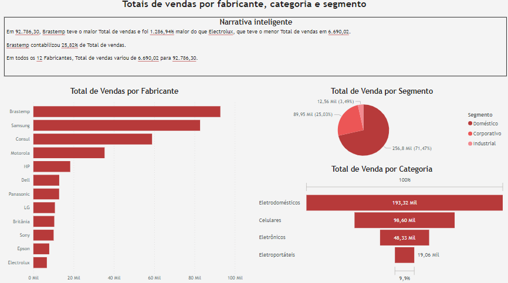
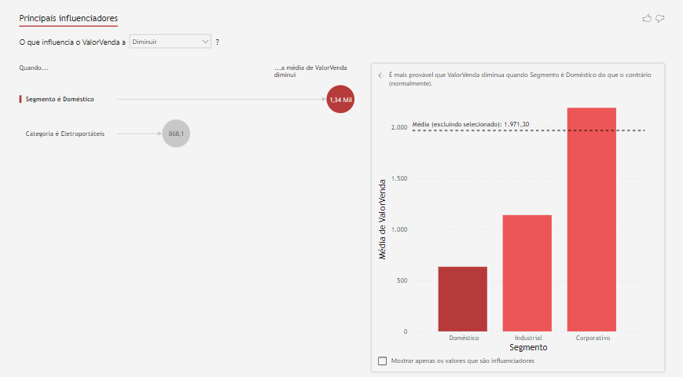
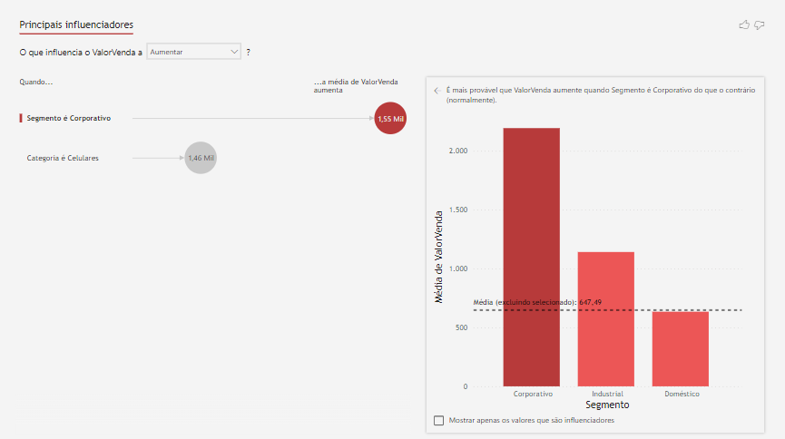
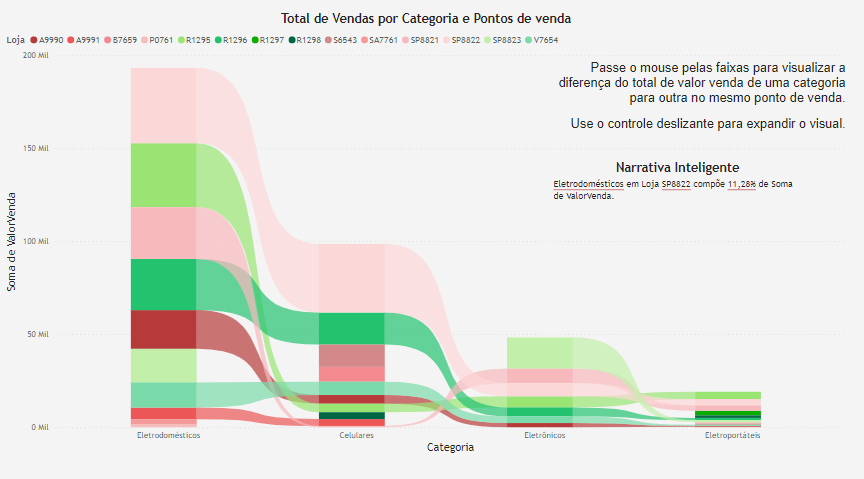
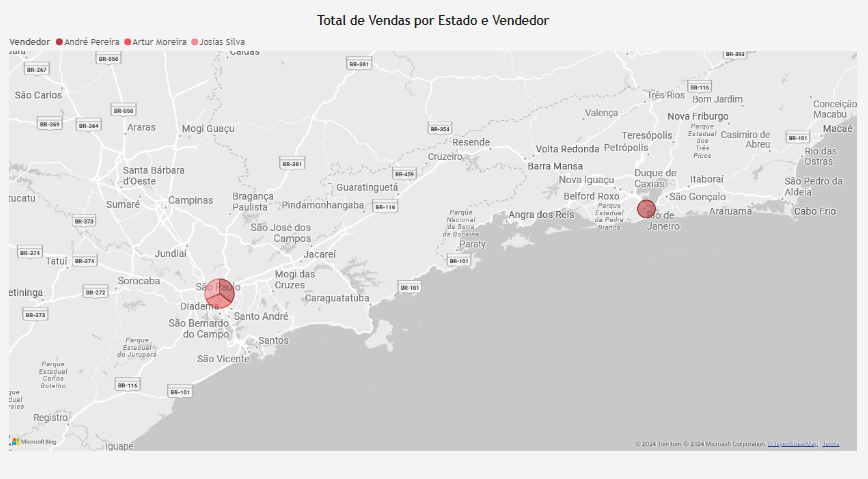

## Mini-Project 02: Commercial Dashboard: Sales Performance

This Mini-Project provides a brief introduction to commercial data analysis with Power BI. Here, I built several visualizations to understand the sales performance of a fictitious company from different angles.

I used fictitious data for this work. During the chapter, I learned how to use interesting Power BI features such as Smart Narrative, Main Influencers, and Band Chart and create a menu for the Dashboard index (shown in the image below).

## Dashboard 01: Total sales by manufacturer, category and segment

## Analysis: Dashboard 01

- Brastemp had the highest total sales, which was more than 1200% greater than Electrolux's total. Brastemp accounted for a quarter of total overall sales.
- The domestic segment presented the highest total sales by segment, followed by the corporate segment.
- Home appliances had the highest number of sales by category, driven by the domestic segment, while small appliances had the lowest. Cell phone commerce was the second largest, influenced by the corporate segment.

## Dashboard 02: Main Influencers

## Analysis: Dashboard 02

- Sales value increases influenced by the corporate segment, especially in the cell phone category.

- On the other hand, from dashboard 01 it can be seen that the total sum of sales is mainly influenced by the consumption of household appliances in the domestic segment, which indicates that there are many sales with lower values in this case.

- Average sales tend to decrease, influenced by small appliances in the domestic segment.

## Dashboard 03: Total sales by category and points of sale

## Analysis: Dashboard 03

- The sale of household appliances at store SP8822 makes up 11% of total sales.

## Dashboard 04: Total sales by State and Seller

## Analysis: Dashboard 04

The highest total sales are in São Paulo, followed by Rio de Janeiro.
