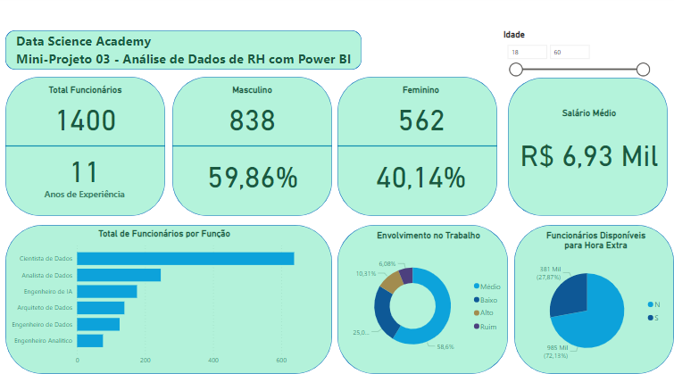

## Mini-Project 03: HR Data Analysis with Power BI 

This Mini-Project briefly introduces HR (Human Resources) data analysis with Power BI. I presented some other Power BI features and functionalities in this project, such as a measurement table and conditional column.

The Dashboard created must answer the following business questions:
1) How many employees are currently in the company?
2) What is the employees' average length of experience (in years)?
3) What is the total and percentage of male and female employees?
4) What is the average monthly salary?
5) What is the total number of employees per function?
6) What percentage of employees are available to work overtime?
7) What is the level of employee involvement at work considering 4 categories: Bad, Low, Medium, and High?
8) This item should not be on the Dashboard but needs to be calculated: What is the total and percentage of employees who should receive a promotion? Consider the “Years Since Last Promotion” column with the following rule: If the employee has been 5 years or more since the last promotion, the promotion must be considered. Otherwise, the promotion should not be considered now.

The data used in this chapter is fictitious.

## Analysis

- In this company there are 1400 employees with around 11 years of experience in general and almost 7 thousand reais in average salary.
- The majority of employees are male.
- Most employees are data scientists, have average work engagement and are not available for overtime.
