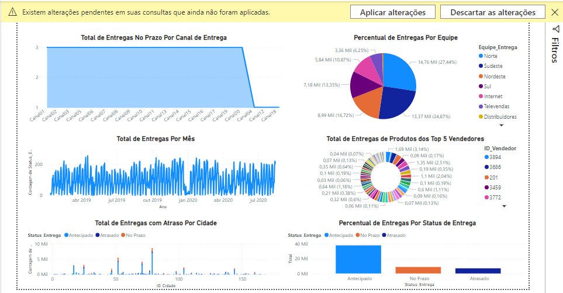
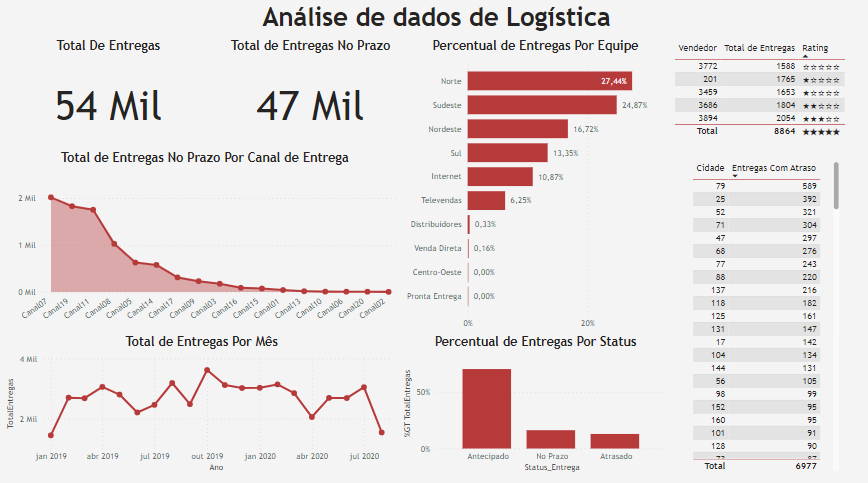

## Mini-Project 4: Deconstructing the Dashboard and Solving Analysis Problems in the Logistics Area

This is a different Mini-Project. The original Dashboard was full of problems and errors, so I deconstructed it to deliver the analyses in a professional way. Below is the scenario description.

A logistics company asked a professional to provide a dashboard to help understand the company's product delivery process. The professional did not seem to have much knowledge about Power BI and delivered work with clear problems and errors. The Dashboard needed to show the following Logistics KPIs:

1) Total On-Time Deliveries By Delivery Channel.
2) Percentage of Early Deliveries Per Delivery Team.
3) Total Deliveries Per Month.
4) Total Product Deliveries from the Top 5 Sellers.
5) Total Delayed Deliveries Per City.
6) Percentage of Deliveries by Delivery Status.

The dataset contains fictitious data.

## Dashboard with errors

## Fixed dashboard

## Corrections made to the dashboard

- The yellow stripe indicates that there is a problem with the data file address.
- The "Total On-Time Deliveries by Delivery Channel" chart has been filtered to only show "On-Time" deliveries
- The "Percentage of deliveries by team" chart doesn't work well as a pie chart because there are too many teams. The best visual would be a bar chart. The graph shows total deliveries in absolute value and was configured to show the percentage of the total.
- The "Total deliveries per month" chart contains a lot of information, which is why the terms "quarter" and "day" were removed from the date hierarchy on the X-axis.
- A total sales measure has been created and added to all charts to make information plotting easier.
- The "Total product deliveries from the top 5 sellers" graph shows all sellers instead of the top 5. Additionally, the values of the top 5 sellers are very similar, so a pie chart is not the best visualization. Then, a table was built, and a rating column was added, giving stars according to the sales ranking.
- The "Total late deliveries by city" graph does not show the desired information. Furthermore, the list of cities is very large, making this bar graph visualization unfeasible. Therefore, a table was adopted.
- The "Percentage of deliveries by delivery status" chart shows the absolute values in each bar but has been edited to show the overall total percentage values.
- Two cards have been added to show total sales and total sales on time.
- The layout has been modified to improve visualization.

## Analysis

- 54 thousand deliveries were made in the period, of which 47 thousand were on time or early.
- The North and Southeast teams account for approximately half of deliveries.
- Channels 7, 19, and 11 had the highest deliveries.
- Total deliveries per month varied between 1500 and 3600 approximately during the period.
- Around 70% of deliveries were anticipated.
- Seller 3984 had the highest total sales.
- City 79 had the highest number of deliveries.
