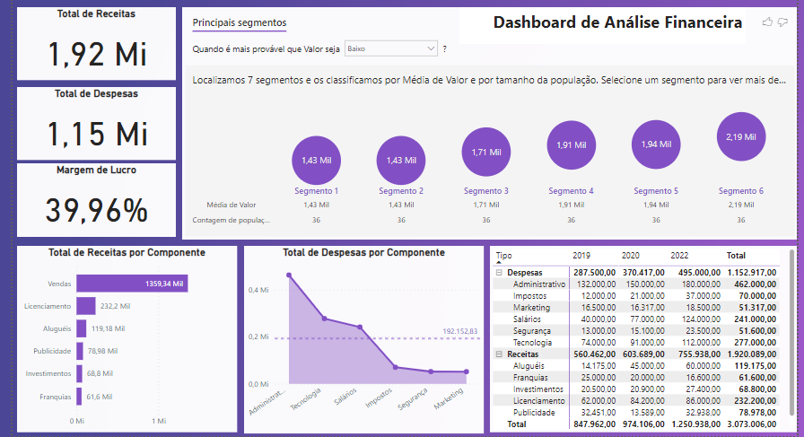

## Miniproject 05: Financial analysis

In this mini-project, I explored some more Power BI features in the context of finance. Below is the description of the scenario:

Your company wants to have a view of revenues and expenses and asked you to create a Dashboard that allows you to analyze the following financial indicators:

1) Total Revenue
2) Total Expenses
3) Profit Margin
4) Total Revenue Per Component
5) Total Expenses Per Component in relation to the average Expenses
6) Total Income and Expenses Per Component and Per Year, with the Type/Component hierarchy.

Furthermore, the company needs to identify the segments with the highest and lowest revenues and expenses in order to draw up its strategic plan. The dataset was constructed with fictitious data.

## Analysis

- Total revenue was 1.92 million reais, total expenses were 1.15 million, and the profit margin was approximately 40%.
- The largest revenues are linked to the Sales component, and the largest expenses are concentrated in the administrative component.
- The Administrative, Technology, and Salaries components exceeded the average expenses.
- Sales and Administration were the biggest influencers to increase the total value, while the Marketing component contributed to the lowest total value.
