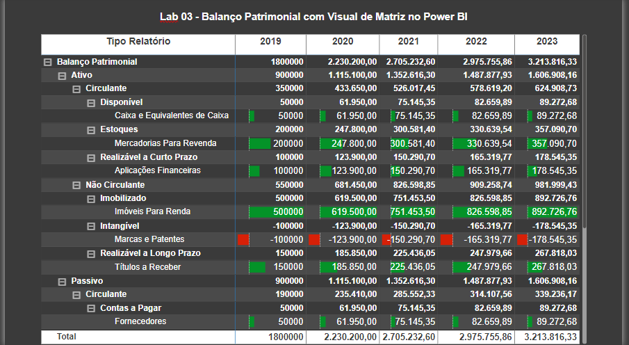

## Lab 3 - Financial Statement with Matrix Visualization in Power BI

This Lab demonstrates step by step how to represent a Balance Sheet in Power BI, exploring the functionalities of the Matrix visual. Through this Lab, several Power BI functionalities will be studied in detail.

