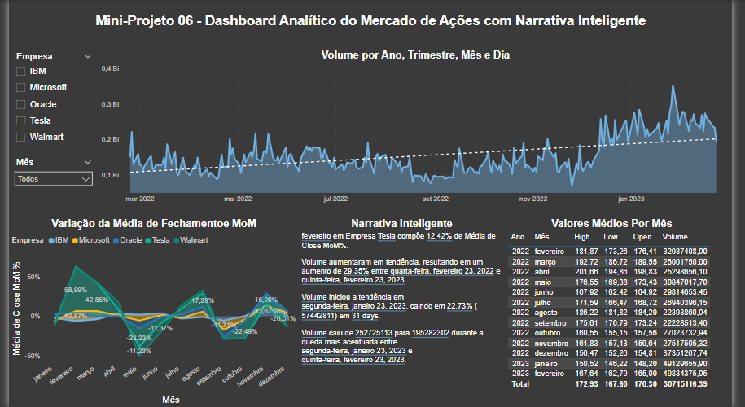

## Mini-Project 6 - Stock Market Analytical Dashboard with Intelligent NarrativeMicrosoft Power BI for Business Intelligence and Data Science

In this Mini-Project I used real, publicly available data and built a Stock Market Analytical Dashboard. I used data from 5 companies: IBM, Microsoft, Oracle, Tesla and Walmart. The data was extracted from the [Nasdaq portal](https://www.nasdaq.com).

The stock price is in fact a time series (that is, an event that occurs over time) and Power BI offers functionality to manipulate this type of data, called Time Intelligence (which is a date manipulation feature in a simplified way).

I used the Smart Narrative feature so that Power BI helps explain the behavior of the data automatically. The Dashboard should answer these business questions below:

1) What is the total trading volume of shares over time for the 5 companies being analyzed? Allow this analysis to be done for a single company or combination of companies.

2) What is the average opening (Open), highest (High), lowest (Low) and closing (Close) value of the shares of all companies for all months of the analyzed data period (1 year in our example )? Show in table format and allow this analysis to be done for a single company or combination of companies.

3) What is the variation in the average close value of shares of all companies over time, month to month? Allow this analysis to be done for a single company or combination of companies.

4) Use Smart Storytelling to explain key features and trends in the data.

5) The Dashboard must be formatted.

#
