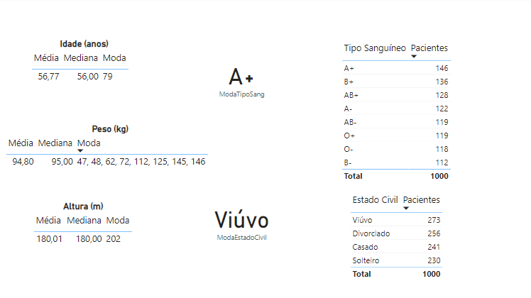

## Exercício - Medidas de Posição e dispersão no Power BI

O dataset disponível possui dados fictícios de pacientes. Crie uma tabela de análise descritiva no Power BI com a média, mediana e moda da idade, altura e peso dos pacientes. Além disso, responda:

1) Qual a moda do tipo sanguíneo?
2) Qual a moda do estado civil?

Com o mesmo dataset, crie outro dashboard. Crie uma tabela de análise descritiva no Power BI com a média, variância e desvio padrão da idade, altura e peso dos pacientes. Além disso, calcule o coeficiente de variação para as três variáveis.

