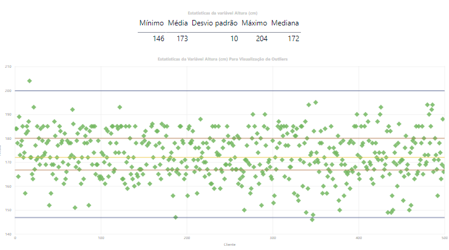
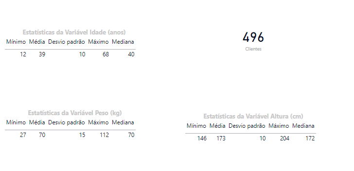

## Lab 4 - Cleaning and Manipulating Customer Registration Data in Power BI

In this Lab the objective is to show you how to use Power BI as a tool for cleaning and manipulating data. There will be 3 activities carried out during the Lab:
- Identification and treatment of duplicate records.
- Identification and treatment of missing values.
- Identification and treatment of outlier values.

#
