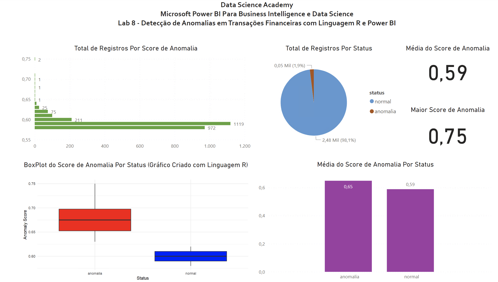

## Lab 8 - Anomaly Detection in Financial Transactions with R Language and Power BI

Imagine that a financial company has historical data from customers with two financial transactions (here called “transacao1” and “transacao2”). Managers believe that some of these transactions may be fraudulent and would like to identify any anomalies. The managers have no idea what an anomaly would be and asked for your help to find a solution. In fact, they don't know whether anomalies actually occurred.

Using fictitious data we will use Machine Learning to group customer financial transaction data and then detect and define anomalies (if they exist). The result must be delivered in visual format through graphs in Power BI. That's what we're going to do from now on. Below is the Dash that will be built:

#
